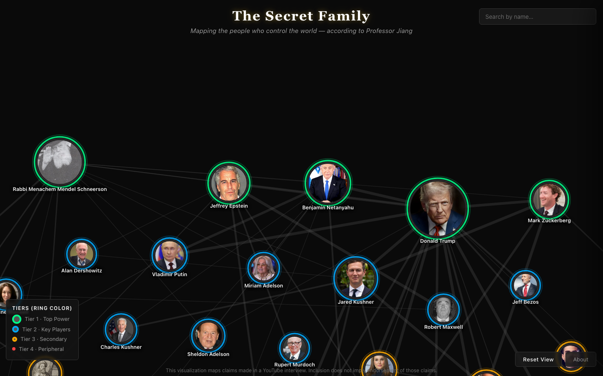

# The Secret Family

Interactive D3.js visualization mapping the power hierarchy of ~60 people discussed in Professor Jiang's YouTube interview.

**Live site:** Open `index.html` in any browser — no server, no build step, no dependencies.

## What it shows

A force-directed graph organized into four tiers of influence:

- **Tier 1 (Top Power)** — green rings
- **Tier 2 (Key Players)** — blue rings
- **Tier 3 (Secondary)** — amber rings
- **Tier 4 (Peripheral)** — red rings

Click any person to highlight their connections and open an intelligence dossier with:
- Historical timeline (Wikipedia + transcript mentions)
- Wikipedia summary
- Expandable transcript source cards with YouTube deep links at exact timestamps

## Features

- **Search by name** — Ctrl+F or use the search box (top-right)
- **Pan & zoom** — drag to pan, scroll to zoom, drag avatars to reposition

## Source

- **Video:** https://www.youtube.com/watch?v=_TlzUQrnI1I
- **Disclaimer:** This visualization maps claims made in a YouTube interview. Inclusion does not imply endorsement of those claims.

## Tech

- [D3.js v7](https://d3js.org/) — force-directed graph, zoom, drag
- [Wikipedia REST API](https://en.wikipedia.org/api/rest_v1/) — summaries, thumbnails, wikitext
- Vanilla JS, inline CSS, zero dependencies